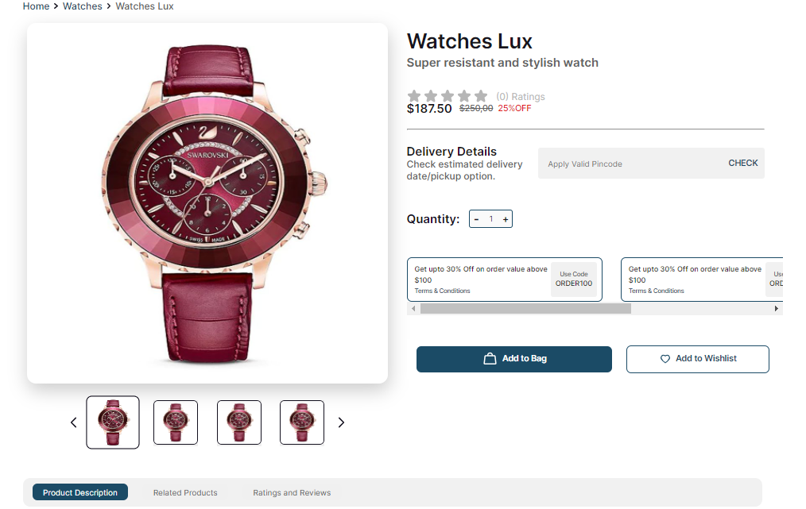
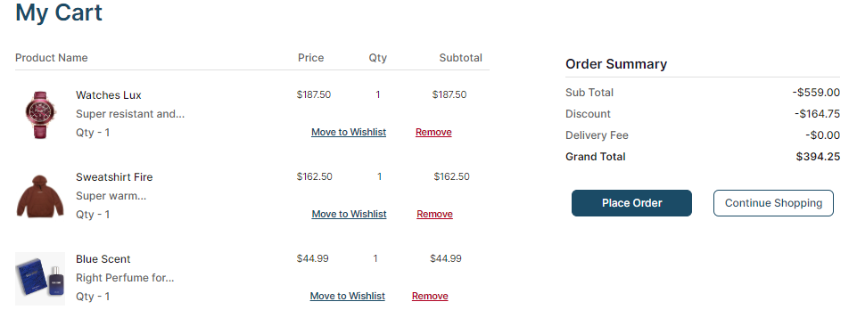
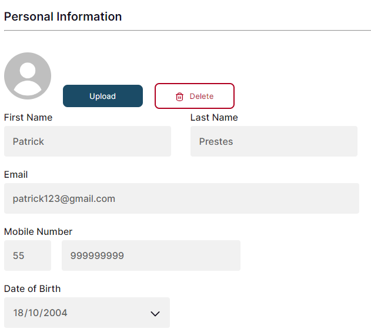

# Project Ecommerce Coral


Project carried out in squad during internship at Compass UOl company.

## 👇Index
- <a href="funcionalidades">Project Features</a>
- <a href="layout">Layout </a>
- <a href="rodar">How to run this project? </a>
- <a href="tecUtilizadas">Technologies used </a>
- <a href="desenvolvedores">Developers </a>
- <a href="futImplementações">Future implementations </a>

## 💻Project Features
- [x] User registration
- [x] Login
- [x] Product page
- [x] Shopping page
- [x] Items added to cart
- [x] User profile

## 📱Layout








## 💡 How to run this project?

```bash
#Clone this repository
$ git clone linkrepositório

#Access the project folder in your terminal
$ cd E-commerce

#Install the dependencies
$ npm install

#Run the application
$npm run dev

#The application will be started on port 3000, go to the browser: http://localhost:3000.

```

## 👨‍💻Technologies used
1. [React](https://pt-br.react.dev/) 
2. [React Router](https://reactrouter.com)
3. [React Icons](https://react-icons.github.io/react-icons)

## 😎Developers
- [Patrick Prestes](https://github.com/Patrick-1810)
- [Leonardo Winter](https://github.com/Leow20)
- [William Klein](https://github.com/William-Klein7)
- [Lucas Hack](https://github.com/lucas-hack)


## 🚀Future implementations
- [ ] Page notifications
- [ ] Feature invite a friend cupom
- [ ] Page my saved cards


